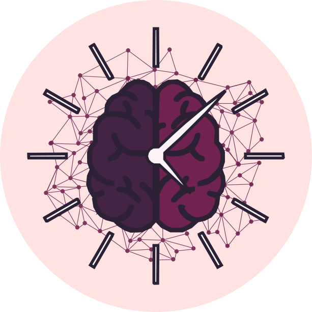
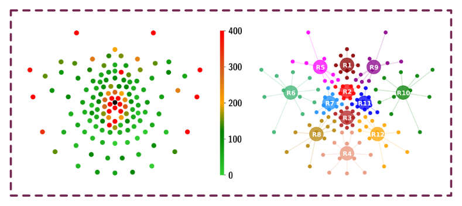
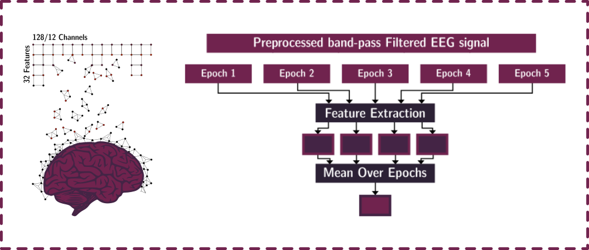
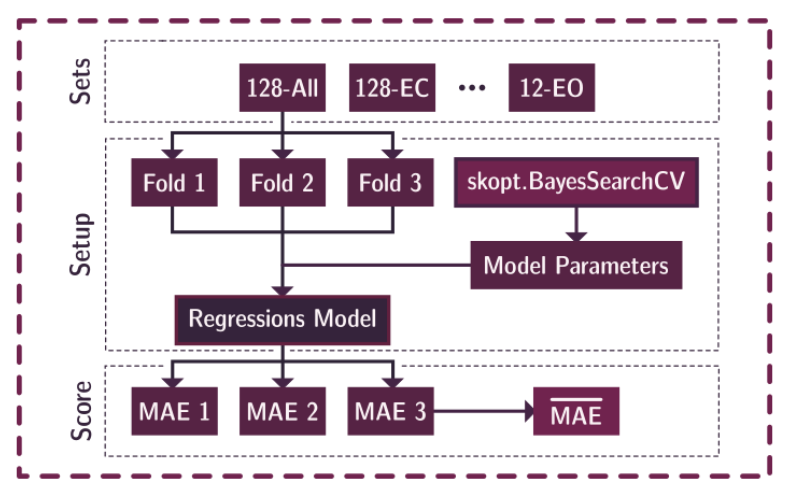
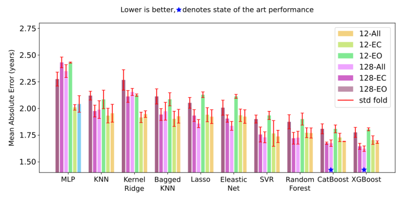

<h1> 
<div class="row">
  <div class="column"></div>
  <div class="column"> Different Algorithms (Might) Uncover Different Patterns: A Brain-Age Prediction Case Study</div>
</div>
<br>
</h1>

Code for the paper ["Different Algorithms (Might) Uncover Different Patterns"](https://github.com/Arsu-Lab/Different-Algorithms-Uncover-Different-Patterns-BrainAge-Prediction/blob/main/paper/BIBM_2023.pdf) first presented in the 2023 IEEE International Conference on Bioinformatics and Biomedicine (BIBM 2023). 

## Overview:
Machine learning techniques are ubiquitous in bioinformatics and EEG research in particular. However, there is still a 
lot of ambiguity and room for experimental design choices in the experiment setup and analysis pipeline. This raises an
important question: Do different experimental design choices, particularly regarding model selection, influence the 
patterns uncovered in EEG data? Such variations could potentially result in differing, or even contradictory, 
interpretations.
### Preprocessing Framework



### Feature Selection & extraction



### Model Training & Tuning



### Performance On The NeuroTechX BrainAge Prediction Dataset



### Computing The SHAPAgreement Across Models


## Contents:


## Cite
```
@INPROCEEDINGS{Ettling_2023,
  author={Tobias Ettling, Sari Sadiya, Gemma Roig},
  booktitle={2023 IEEE International Conference on Bioinformatics and Biomedicine (BIBM)}, 
  title={Different Algorithms (Might) Uncover Different Patterns: A Brain-Age Prediction Case Study}, 
  year={2023},
  volume={},
  number={},
  pages={},
  doi={}
}
