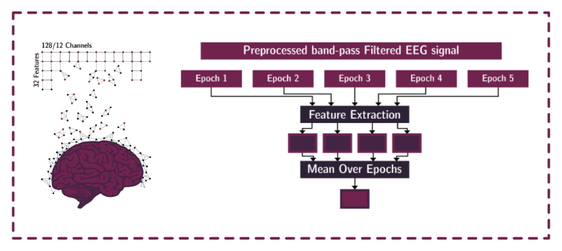
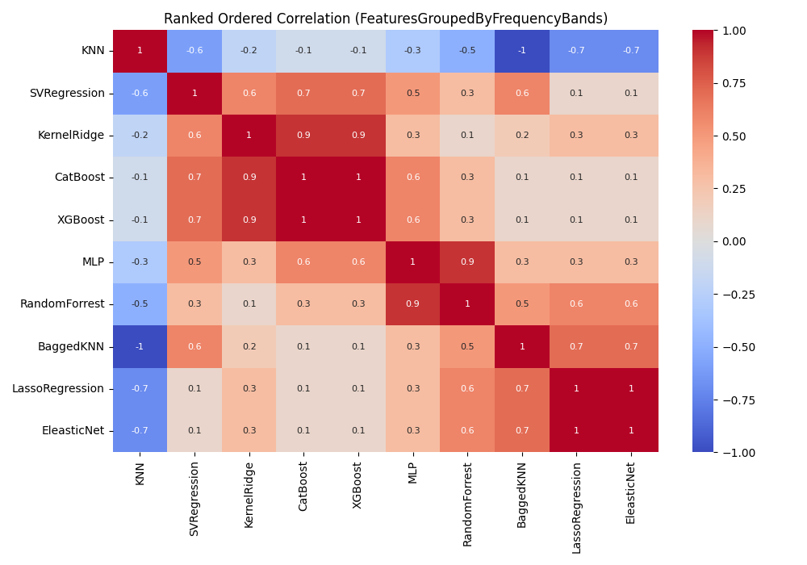

<h1> 
<div class="row">
  <div class="column"></div>
  <div class="column"> Different Algorithms (Might) Uncover Different Patterns: A Brain-Age Prediction Case Study</div>
</div>
</h1>

Code for the paper ["Different Algorithms (Might) Uncover Different Patterns"](https://github.com/Arsu-Lab/Different-Algorithms-Uncover-Different-Patterns-BrainAge-Prediction/blob/main/paper/BIBM_2023.pdf) first presented in the 2023 IEEE International Conference on Bioinformatics and Biomedicine (BIBM 2023). 

## Overview:
Machine learning techniques are ubiquitous in bioinformatics and EEG research in particular. However, there is still a 
lot of ambiguity and room for experimental design choices in the experiment setup and analysis pipeline. This raises an
important question: Do different experimental design choices, particularly regarding model selection, influence the 
patterns uncovered in EEG data? Such variations could potentially result in differing, or even contradictory, 
interpretations.
### Preprocessing Framework


### Feature Selection & extraction



### Model Training & Tuning


### Performance On The NeuroTechX BrainAge Prediction Dataset


### Computing The SHAPAgreement Across Models



## Contents:
* `data`: we have provided sample data we used in the paper for demonstration purposes.
  - `example_eeg`: contains eeg from one subject including eyes opened and closed states.
    - `example_subj_EC_raw.fif.gz`: sample eeg recording for eyes closed resting state.
    - `example_subj_EO_raw.fif.gz`: sample eeg recording for eyes opened resting state.
    - `example_subj_EC_preproc.pickle`: preprocessed eeg data from *example_subj_EC_raw.fif.gz*.
    - `example_subj_EO_preproc.pickle`: preprocessed eeg data from *example_subj_EO_raw.fif.gz*.
  - `example_training_set`: contains the `12-all` training set we used in the paper.
  - `example_shap_values`: contains the shap values for our best model (XGBoost) trained on the `12-all` training set.
* `models`: contains the corresponding code for each of the 10 models explored in the original paper.
  - `training.ipynb`: contains the code for training and tuning the models.
  - `shap_values.ipynb`: contains the code for computing the shap values.
* `example_eeg_preprocessing.ipynb`: a step by step notebook showcasing how to to run our data prerpocessing pipeline. 
* `example_eeg_feature_extraction.ipynb`: a step by step notebook showcasing how to run our feature extraction pipeline. 
* `example_plot_interpolation_map.ipynb`: a step by step notebook showcasing how to create the regional interpolation plots.
* `example_aggregated_shap_value.ipynb`: a step by step notebook showcasing how to aggregate shap values and create rank orders of the feature groups based on the shap value.

## Cite
```
@INPROCEEDINGS{10385662,
  author={Ettling, Tobias and Saba-Sadiya, Sari and Roig, Gemma},
  booktitle={2023 IEEE International Conference on Bioinformatics and Biomedicine (BIBM)}, 
  title={Different Algorithms (Might) Uncover Different Patterns: A Brain-Age Prediction Case Study}, 
  year={2023},
  pages={4051-4058},
  keywords={Machine learning algorithms;Focusing;Prediction algorithms;Brain modeling;Feature extraction;Robustness;Electroencephalography},
  doi={10.1109/BIBM58861.2023.10385662}
}
```